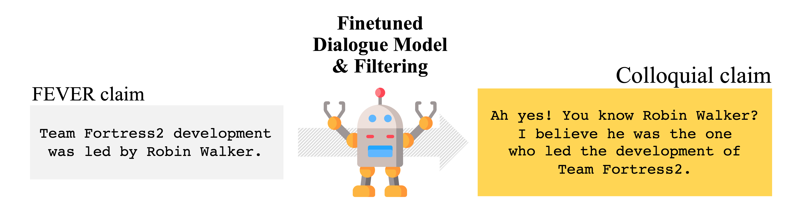

# How Robust are Fact Checking Systems<br>on Colloquial Claims?



**Official PyTorch implementation of our NAACL paper:**<br>
[Byeongchang Kim](https://bckim92.github.io)\*, [Hyunwoo Kim](https://hyunw.kim)\*, [Seokhee Hong](https://vision.snu.ac.kr/people/seokheehong.html), and [Gunhee Kim](https://vision.snu.ac.kr/gunhee). How Robust are Fact Checking Systems on Colloquial Claims? *NAACL-HLT*, 2021 [[Paper]](https://www.aclweb.org/anthology/2021.naacl-main.121/) (\* equal contribution)

If you use the materials in this repository as part of any published research, we ask you to cite the following [paper](https://www.aclweb.org/anthology/2021.naacl-main.121/):

```bibtex
@inproceedings{Kim:2021:colloquial,
  title={How Robust are Fact Checking Systems on Colloquial Claims?},
  author={Kim, Byeongchang and Kim, Hyunwoo and Hong, Seokhee and Kim, Gunhee},
  booktitle={NAACL-HLT},
  year={2021}
}
```

## *Colloquial Claims* dataset

You can download the paper version of our Colloquial Claims dataset via following urls: <br>
[[train]](https://drive.google.com/file/d/1UDW1p15cN8K7iSMgocPDiv_RUw1DHgfz/view?usp=sharing)
[[valid]](https://drive.google.com/file/d/1c4D7gbYGBNZXqF1cRZxUfrkIOJnwFO8D/view?usp=sharing)
[[test]](https://drive.google.com/file/d/10p5YAXbuoko64i-FlhV4eQlzQ8c4Bnio/view?usp=sharing)

You can read and explore the dataset as follows:
```python
import json

turns = []
with open('colloquial_claims_train.jsonl', 'r') as fp:
    for line in fp:
        turns.append(json.loads(line))

print(turns[0].keys())
# dict_keys(['colloquial_claims', 'fever_claim', 'fever_label', 'evidences', 'gold_evidence_set', 'fever_id'])
```


## Running style transfer pipeline

In progress
